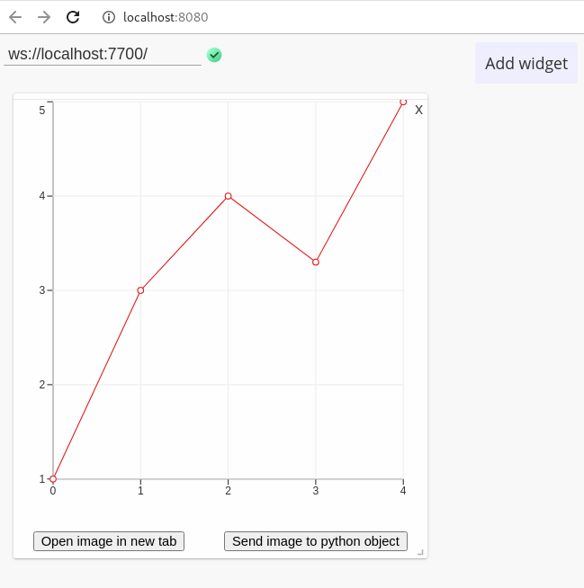

<div align="center">
    
</div>

This is a screenshotable [libvis](http://libvis.dev) module.

It adds a possibility to send images from your live visualization back to python.

# Installation

```
libvis-mods download gh:libvis/screenshotable
cd screenshotable
libvis-mods install
```

# Usage

```python
from libvis.modules import screenshotable
from libvis import Vis

vis = Vis()

my_graph = [1, 2, 5, 3.5. 4]

wrapped = screenshotable(my_graph)
vis.vars.test = wrapped
wrapped.show()

```

The state of `vis.vars.test` will be visualised live at `localhost:7000/`. 

The graph will be augmented by two buttons that allow
sending screenshot to the python object.
access base-64 encoded data at `object.image`.



# Documentation

[docs.libvis.dev](http://docs.libvis.dev)
